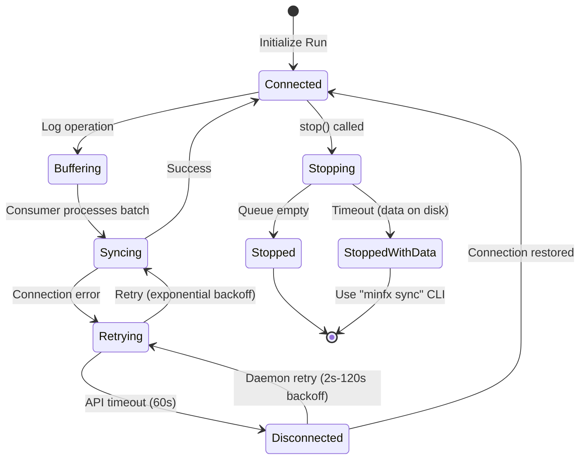

    
 <h1>neptune.ai Legacy</h1>

  <a href="https://neptune.ai/">Website</a>
  &nbsp;&nbsp;•&nbsp;&nbsp;
  <a href="https://docs.neptune.ai/">Docs</a>
  &nbsp;&nbsp;•&nbsp;&nbsp;
  <a href="https://neptune.ai/blog">Blog</a>
&nbsp;
  

> [!IMPORTANT]
> This is the legacy client. 
> For the new Neptune client, go to **[neptune-client-scale &rarr;][client]**

> [!NOTE]
> If you need to access Neptune Legacy (app version `2.x`), see the [legacy documentation][legacy-setup] for setup instructions.

&nbsp;
## Support

If you get stuck or simply want to talk to us about something, here are your options:
* Chat! In the Legacy app, click the blue message icon in the bottom-right corner and send a message. A real person will talk to you ASAP (typically very ASAP).
* Shoot us an email at [support@neptune.ai](mailto:support@neptune.ai).

&nbsp;

## Connection Handling

The neptune_v2 SDK is designed to be resilient to network issues. It implements a multi-layer retry and buffering strategy to ensure no data is lost during connection problems.

### Connection Modes

| Mode | Description | Buffering | Retries |
|------|-------------|-----------|---------|
| `async` (default) | Background syncing | Disk-based | Yes |
| `sync` | Immediate API calls | None | Yes |
| `offline` | No network | Disk-based | N/A |
| `debug` | Mock backend | Memory | N/A |

### Buffering (Async Mode)

In async mode, all operations are immediately written to a local disk queue before being sent to the server:

- **Location**: `.neptune/async/<container_id>/`
- **Files**: `data-*.log` (operations), `last_put_version`, `last_ack_version`
- **Persistence**: Data survives process crashes and can be synced later via `minfx sync` CLI

### Retry Strategy

#### API Level (per-request)
- **Timeout**: 60 seconds total (configurable via `NEPTUNE_RETRIES_TIMEOUT_ENV`)
- **Backoff**: Exponential `2^n` seconds, capped at 30 seconds
- **Handled errors**: Connection errors, timeouts, HTTP 5xx, 429 (rate limit)

#### Daemon Level (background thread)
- **Retries**: Infinite while the daemon is running
- **Initial backoff**: 2 seconds
- **Max backoff**: 120 seconds (doubles each failure)
- **Recovery**: Logs "Communication with Neptune restored!" when connection recovers

### Shutdown Behavior

When `stop()` is called on a run:

1. Disables sleep and wakes the consumer thread
2. Waits for the queue to empty (default: 60s timeout via `NEPTUNE_SYNC_AFTER_STOP_TIMEOUT`)
3. If connection is lost during stop: waits for reconnection up to the timeout
4. On success: removes local data files
5. On timeout: keeps data on disk for manual sync via `minfx sync`

### State Machine

### Environment Variables

| Variable | Default | Description |
|----------|---------|-------------|
| `NEPTUNE_RETRIES_TIMEOUT` | 60 | API retry timeout in seconds |
| `NEPTUNE_SYNC_AFTER_STOP_TIMEOUT` | 60 | Wait time for queue sync on stop |
| `NEPTUNE_ASYNC_BATCH_SIZE` | 1000 | Operations per batch |

&nbsp;

[client]: https://github.com/neptune-ai/neptune-client-scale
[legacy-setup]: https://docs-legacy.neptune.ai/setup

---
932aeafe 2026-01-22T01:15:37
